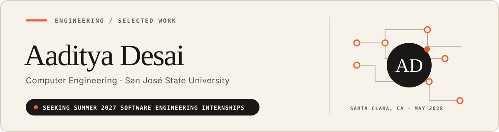

  

  &nbsp;&nbsp;&nbsp;
  &nbsp;&nbsp;&nbsp;
  &nbsp;&nbsp;&nbsp;
  

I build software that has to work within real constraints: limited compute, unreliable connectivity, tight latency budgets, or a bounded context window. I like working through the full system, from the model or protocol to the application around it.

## Selected work

### 01 / [Accordion](https://github.com/a-Fig/accordion) · [Live site](https://get-accordion.dev)

**The Problem:** Long coding sessions eventually fill an agent's context window. The usual fix is to compress everything into one summary, which can remove details the agent needs later.

**The Solution:** Accordion treats the context window as reversible blocks that can be folded, unfolded, and pinned. I worked on the keyword, bi-encoder, and cross-encoder relevance pipeline. Our team built it at the 2026 UC Berkeley AI Hackathon and won The Token Company sponsor track.

  <strong>Tech Stack:</strong>&nbsp;&nbsp;
  &nbsp;
  &nbsp;
  &nbsp;
  

---

### 02 / [GazeBoard](https://github.com/aadityad12/GazeBoard)

**The Problem:** A gaze-based communication aid should not require dedicated hardware or send continuous face video to a server.

**The Solution:** GazeBoard turns an Android phone into an offline gaze-to-speech device. I built the pipeline from CameraX capture through face detection, LiteRT inference, four-point calibration, dwell selection, and text-to-speech. The app declares no network permission and targets the Qualcomm Hexagon NPU.

  <strong>Tech Stack:</strong>&nbsp;&nbsp;
  &nbsp;
  &nbsp;
  &nbsp;
  

---

### 03 / [ApexTracker](https://github.com/aadityad12/Apex-Tracker)

**The Problem:** Budgets, study time, reminders, notes, screen time, and reading lists often end up in separate apps, each with its own account and cloud dependency.

**The Solution:** ApexTracker puts those workflows in one offline-first Android app that I use every day. Room remains the source of truth, while sign-in adds optional Firestore sync. The codebase includes encrypted storage, biometric access, reboot-safe alarms, widgets, schema migrations, and automated tests.

  <strong>Tech Stack:</strong>&nbsp;&nbsp;
  &nbsp;
  &nbsp;
  &nbsp;
  

---

### 04 / [Temper](https://github.com/aadityad12/Temper)

**The Problem:** When an AI agent performs poorly, it is hard to tell whether the model is the problem or whether its prompt, tools, or skill files are getting in the way.

**The Solution:** Temper compares an agent environment with a bare-model baseline on the same tasks. It finds regressions, generates targeted replacement files, and runs the affected checks again. I built the local evaluation harness, FastAPI service, patch loop, and deterministic integration path.

  <strong>Tech Stack:</strong>&nbsp;&nbsp;
  &nbsp;
  &nbsp;
  &nbsp;
  

---

### 05 / [Echo](https://github.com/aadityad12/Echo)

**The Problem:** Emergency alerts depend on the same internet and cellular infrastructure that may fail during a disaster.

**The Solution:** Echo is a prototype for receiving, storing, and relaying alerts between nearby phones over Bluetooth Low Energy. It uses a custom chunked-transfer protocol with native Android and iOS GATT servers, plus Raspberry Pi relay tools and offline translation for received alerts.

  <strong>Tech Stack:</strong>&nbsp;&nbsp;
  &nbsp;
  &nbsp;
  &nbsp;
  &nbsp;
  

---

### 06 / [Clear Dispatch](https://github.com/aadityad12/Clear-Dispatch)

**The Problem:** During call surges, dispatchers have to triage incidents and assign resources quickly. In a high-stakes workflow, automation also needs clear human control.

**The Solution:** Clear Dispatch is a local emergency-dispatch simulation with intake, triage, routing, and briefing stages. Heavy resources remain blocked until a dispatcher approves them, while a WebSocket dashboard streams calls, assignments, holds, and audit events in real time.

  <strong>Tech Stack:</strong>&nbsp;&nbsp;
  &nbsp;
  &nbsp;
  &nbsp;
  &nbsp;
  

